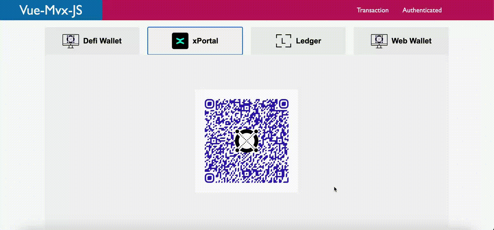
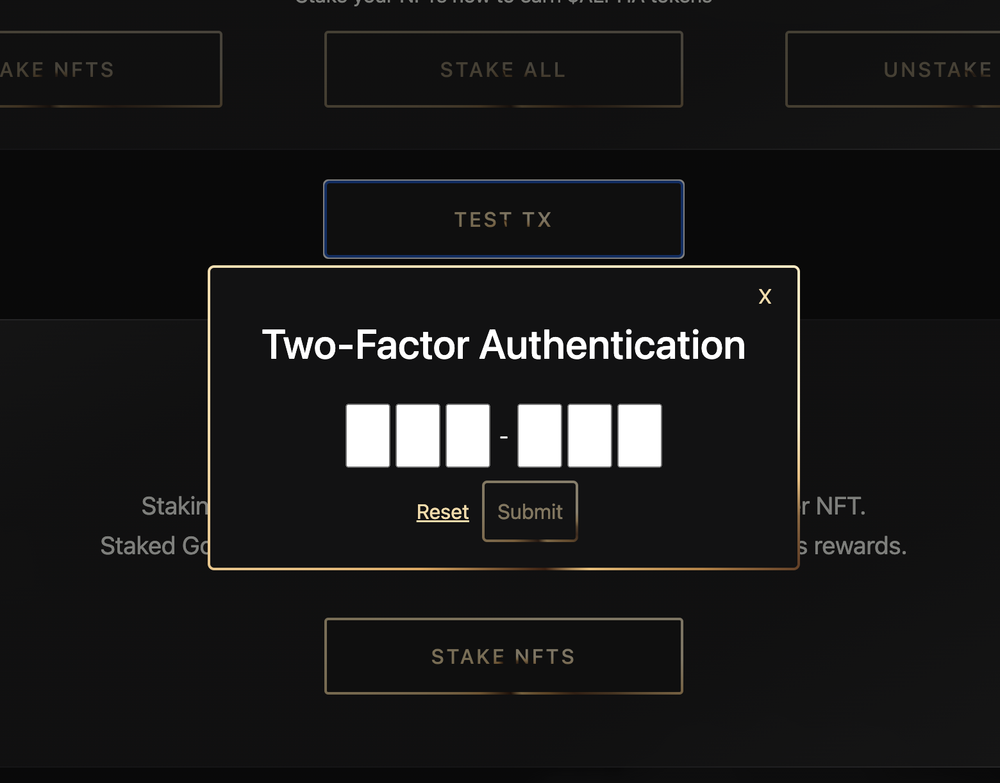

# This document is a detailed report of my open-source contributions to vue-mvx (original repo later made private).
## Open Source Project Contributions: vue-mvx

|               Author | Well                                                                                                         |
|---------------------|---------------------------------------------------------------------------------------------------------------------------------|
|              Project | [vue-mvx](https://github.com/NiftyWell/vue-mvx)                                                                            |
|              License | [MIT](https://www.npmjs.com/package/vue-mvx?activeTab=versions)                                                                                                                            |
|         Contribution Evidence  | [Commit for PR#8](https://github.com/NiftyWell/vue-mvx/commit/7c5a8131cb87f6a5dbfdc7bfa6ab40793e0337a8), [Commit for PR#12](https://github.com/NiftyWell/vue-mvx/commit/82cdf78fe1d1c245de4ec786ba8662b028c91f70), [Commit for PR#13](https://github.com/NiftyWell/vue-mvx/commit/36622588f7b86c80122a841a00f1fc299939614e), [Commit for PR#14](https://github.com/NiftyWell/vue-mvx/commit/c0f457ba840f8bd976b93e592a75d1d94d48d6e4), [Commit for PR#15](https://github.com/NiftyWell/vue-mvx/commit/65aa53ac25efb402833358e7ae6798a2c9334dcc) |
|            PR Status | Merged                                                                                                          |    

Details about the license: The MIT License is a permissive open-source license that allows for free use, modification, and distribution of software, while absolving the original author of any liability. 

## About the Project
This report documents my contributions to the [vue-mvx](https://github.com/NiftyWell/vue-mvx) project. Vue-mvx is a plugin for Vue.js applications that interact with the [MultiversX blockchain](https://docs.multiversx.com/welcome/welcome-to-multiversx). It incorporates [MultiversX JavaScript SDKs](https://docs.multiversx.com/sdk-and-tools/overview/) to facilitate building dApps in Vue3.

## How vue-mvx Works
Vue-mvx utilizes multiple MultiversX packages for transaction signing and managing connection strategies with applications, specifically integrating with [Ledger](https://docs.multiversx.com/wallet/ledger), [WebWallet](https://wallet.multiversx.com/), [DefiWallet](https://docs.multiversx.com/wallet/wallet-extension/) and [walletconnect](https://walletconnect.com/) through the [xPortal](https://docs.multiversx.com/wallet/xportal) mobile app.

## Why Contribute to This Project?
My involvement with MultiversX blockchain projects began two years ago, focusing on Rust smart contracts and React/Vue dApps.  
A service provider on the chain recommended my help for a market place aggregator project using Vue as their Node.js framework, which aimed to enable the purchase of multiple non-fungible tokens from different contracts at once ([PR#8](https://github.com/NiftyWell/vue-mvx/commit/7c5a8131cb87f6a5dbfdc7bfa6ab40793e0337a8)). 
My involvement with the MultiversX community, primarily through their official Telegram group, led me to look deeper into the vue-mvx package and the MultiversX network providers' code. Despite searching, I couldn't find a way to sign and send multiple transactions to various recipients simultaneously. 
In November 2022, I attended the [xDay](https://multiversx.com/blog/x-day-in-paris) conference in Paris, where I met the core team and many community members. Discussions there and later on the messaging group revealed the absence of the functionality I was seeking and opened the door for me to contribute.  
This experience marked my first, albeit small, [open-source contribution](https://github.com/multiversx/mx-sdk-js-network-providers/pull/28) to a core project and led to my initial contribution to the vue-mvx package with [PR#8](https://github.com/NiftyWell/vue-mvx/commit/7c5a8131cb87f6a5dbfdc7bfa6ab40793e0337a8).

## Contribution
I've decided to make a new open-source contribution to the vue-mvx package, particularly for users with guarded accounts following a MultiversX update.

## What's a Guardian?
In the MultiversX ecosystem, a Guardian is an additional signer for transactions from a delegated guarded account, enhancing security by requiring signatures from both the account holder (guarded account) and the Guardian.

## What's an Invisible Guardian (2FA)?
The Invisible Guardian feature is a two-factor authentication (2FA) system in MultiversX. The guardian address is provided by a MultiversX service, and it will co-sign transactions only if the correct 2FA code is sent to the corresponding API.

## Contribution Journal
### September 2023: 
I noticed during the early summer of 2023 that users with guarded accounts were facing difficulties interacting with the blockchain through dApps using the vue-mvx package. I've notified the package owner, but I didn't go look into details to find the reason why. 
 
I've decided to take a deeper look and found out that besides the need to update the dependencies, the main issue was actually caused by the xPortal mobile app, which wouldn't manage the retrieval of the 2FA code from the user automatically, which meant that there was a need to add a way for developers to get the 2FA code using their app's front-end and get the invisible guardian's signature before sending the transaction on chain.

### October 24, 2023: 
Inspired by conversations within the MultiversX community and a [blog](https://blog.giantsvillage.com/erd-react-hooks-support-for-guarded-accounts-tech-article-5c9a34f409ee) post by Elrond Giants about their react hooks implementation, I experimented with the transaction payload. I discovered the necessary steps for successful transactions with an invisible guardian: fetching the address's guardian information using the public api, obtaining the 2FA code from the user, sending it through the API, requesting the guardian's cosignature, applying this signature to the transaction, and updating the transaction with guardian-related data before sending it to the gateway.

### October 25, 2023: 
I had to work on a proper UI for app users to be able to easily insert their 2FA code and send transactions when using the [walletconnect](https://walletconnect.com/) connection method through the xPortal app.
The first iteration of the modal wasn't very developer-friendly and was a bit difficult to integrate into already existing applications.  
Developers needed to import the modal and call it with specific parameters to make it work properly.  
You would need to call it conditionally in the vue template, passing a custom `@submit` function and `@reset` tag.  
This meant developers using the package would need to add custom code and watchers to handle the 2FA input of the user on every page of their app that needed to create and send transactions. 
It also had to close and reopen the pop-up when checking the validity of the 2FA code, which made it look a little clumsy.
### November 3, 2023: [PR#12](https://github.com/NiftyWell/vue-mvx/commit/82cdf78fe1d1c245de4ec786ba8662b028c91f70), first PR
I've updated the modal to its final look.
I had to do some modifications to how the package managed event buses to pass information from the modal to the network providers (which will then handle signing and sending the transaction). 
The biggest benefit was that now developers only needed to import the modal and invoke it once in their front-end template by calling `<VueErdjs2FA />`, everything else would be managed behind the scenes by the package. 
The animated gif shows how the modal pops up when an address connected with the xPortal mobile app and with an invisible guardian wants to send a transaction.
 

  

### November 27, 2023: [PR#13](https://github.com/NiftyWell/vue-mvx/commit/36622588f7b86c80122a841a00f1fc299939614e)
On the recommendation of Stephane Leroy, the creator of the package, I've updated the CSS styling from inside the modal component to a scss styling in the central `src/sass/vue3rdj5.scss` file of the project to allow developers to easily match the styling of the modal to the frontend of their apps.  
Example of updated styling: 
 

  

### December 9-11, 2023: [PR#14](https://github.com/NiftyWell/vue-mvx/commit/c0f457ba840f8bd976b93e592a75d1d94d48d6e4)
The third pull request is linked to an issue I've encountered a year ago, but didn't know how to fix back then.  
While trying to integrate my update to another project's dApp I've stumbled on an [issue](https://github.com/stephaneLeroy/vue-mvx/issues/7) I've first encountered in october 2022 with other community members. 
When using the [WebWallet](https://wallet.multiversx.com/) connection strategy, certain transactions wouldn't go through and would block the dApp. 
I had communicated about this issue with the package owner in 2022 but he didn't have the time to take a deeper look, and I couldn't figure out the root of the issue. 
Now that I've looked at the project in detail I knew why the problem took place and created a PR that fixed the issue, which was caused by the encoding and decoding of the base64 data payload of transactions. 

### December 18, 2023: [PR#15](https://github.com/NiftyWell/vue-mvx/commit/65aa53ac25efb402833358e7ae6798a2c9334dcc)
My last pull request is a little unfortunate. 
While I was finishing updating the dApp of a certain project to include the fixes I've pushed so far, I realized that nothing was working anymore. 
After taking a look at the update logs of the core MultiversX team, I've noticed that they finally included the getting of the 2FA codes and cosigning directly in the xPortal app, which not only rendered my main contribution useless, but actually broke the current version of the package. 
I had to remove all the restructuring made to handle events bus, the modals and so on, to finally only keep the dependency version updates and bug fixes I made along the way.

## Conclusion
My experience with open-source contributions, particularly within the MultiversX community, has been rewarding. 
I could consider the majority of the work I put into my contribution to be useless, but the amount of knowledge I've gathered from working on it has been priceless. 
Further more I've learned that just by honestly trying to improve things for the community and sharing open source code, like minded people and projects will reach out offering collaboration opportunities.  
This shows that even if there may not always be an immediate gain from contributing to open source code, the long term rewards may very well be worth it.
